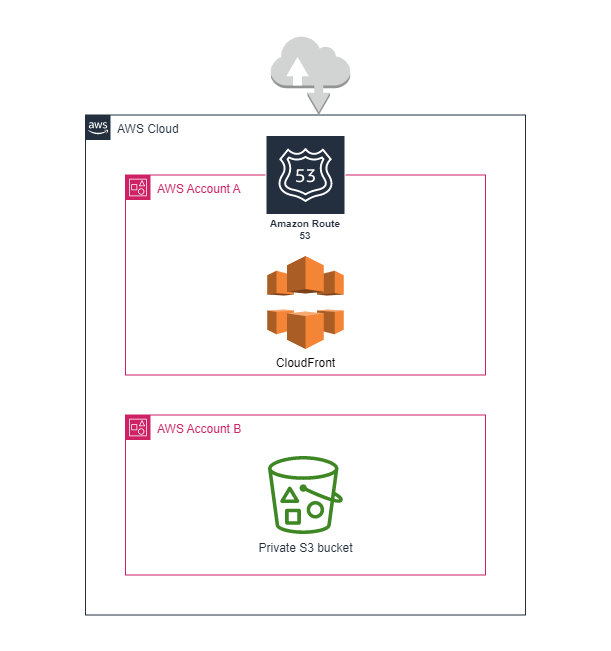

# cloudfront-to-s3
This repository contains a tiny `cloudfront-to-s3` module along with an example of its usage.  
Using the module you can setup a CloudFront distribution with an alternate domain that will serve a content from a private S3 bucket located in a different AWS account. This might be useful in organizations, where Internet-facing resources are deployed in a dedicaded AWS account (for example, MGMT), while S3 buckets might be distibuted accross other accounts (for example, DEV/STAGE/PROD).  
Content from the example is avialable by this link - [https://cloudfront-content-to-s3.eurotunnel.cloud/](https://cloudfront-content-to-s3.eurotunnel.cloud/)

## Architecture
The following diagram shows the architecture behind the solution:


## Usage
Let's look at the `main.tf` as an example:
```
module "cloudfront-to-s3" {
  source = "./modules/cloudfront-to-s3"

  content_source      = "bucket-content"
  bucket_name         = "cloudfront-content-to-s3"
  default_root_object = true
  root_object_name    = "index.html"
  domain_name         = "eurotunnel.cloud"
  cloudfront_account  = "000123456789"
  providers = {
    aws.cloudfront = aws
    aws.s3         = aws.prod
  }
}
```
Since AWS resources are deployed in different AWS accounts, at least two AWS providers should be configured and it's expected that terraform has appropriate access to both of them. As can be found in `backend.tf`, CloudFront distribution and associated Route53 subdomain are configured within `mgmt` AWS account in this example, while private S3 bucket in `prod` account. This account should be explicitly matched with `aws.cloudfront` and `aws.s3` aliases when calling the module.  
Other parameters include:  
`content_source` - folder where files to be stored in S3 bucket are located;  
`bucket_name` - S3 bucket name;  
`default_root_object` - controls whether distribution should have a default root object;  
`root_object_name` - default root object name;  
`domain_name` - domain name for which a new subdomain will be created and associated with CloudFront distribution;  
`cloudfront_account` - AWS account id of account where CloudFront distribution is created (this is needed to set up S3 bucket policy);  
